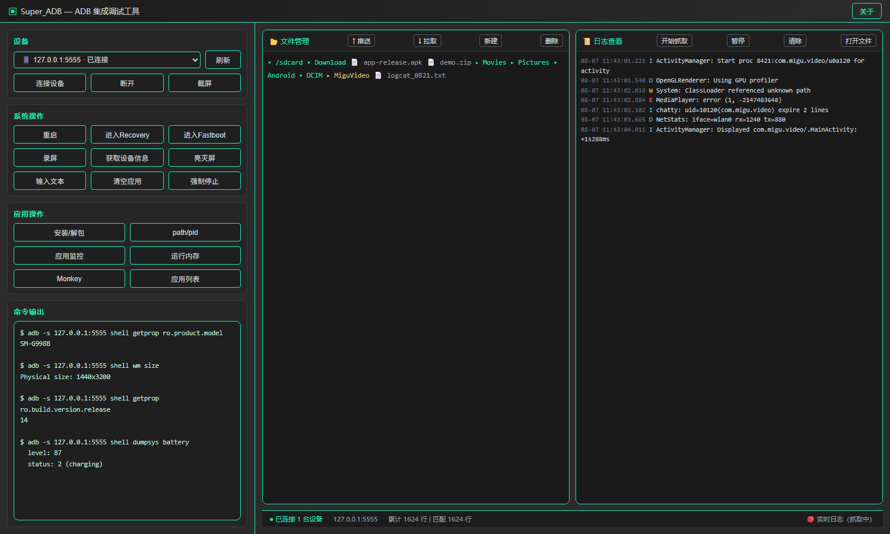
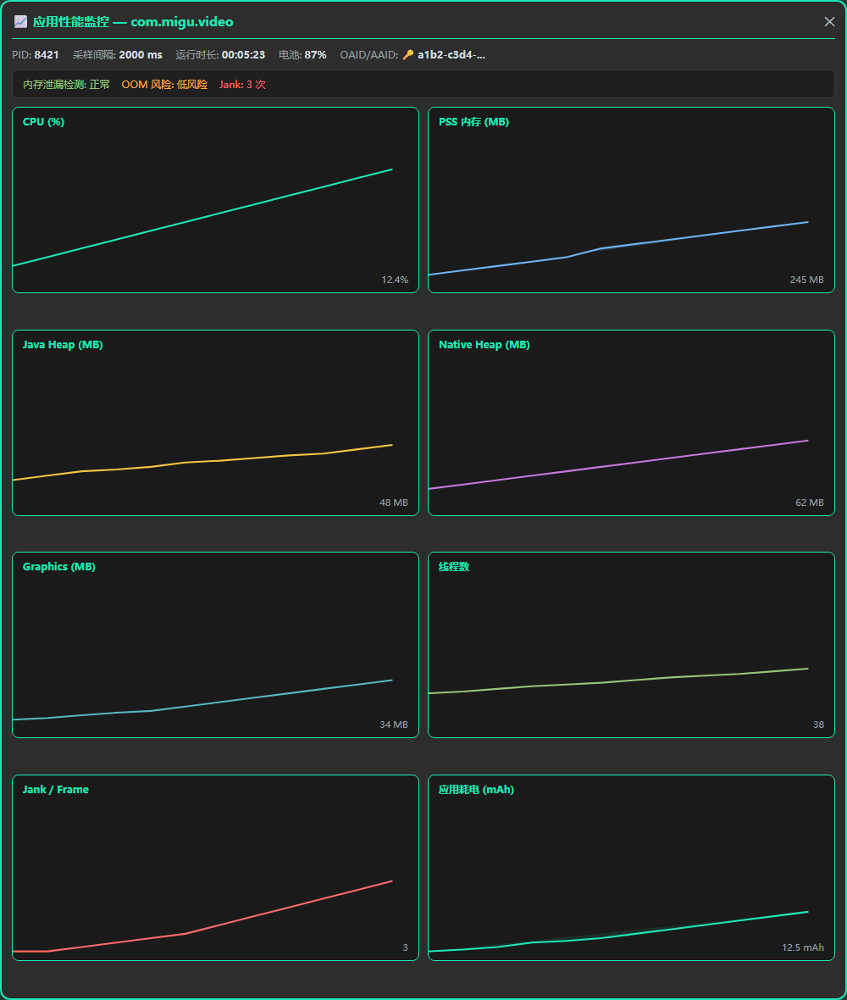
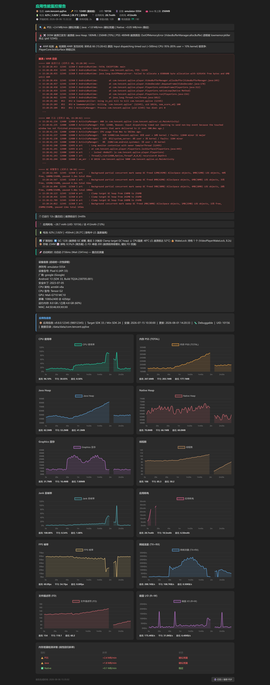

# Super_ADB

<p align="center">
  
  
  
  
</p>

> 🚀 一款基于 **Python 3 + PySide6** 开发的跨平台 ADB 图形化管理工具。  
> 专为 Android 开发者与测试工程师打造，提供设备信息、性能监控、自动化测试、文件管理、日志分析等一站式解决方案。

---

## ✨ 核心功能

### 🔌 设备管理
- ✅ **多设备支持**：支持 USB / WiFi 多设备同时连接与快速切换
- ✅ **快捷操作**：一键连接/断开、设置/清除代理、设备重启
- ✅ **深度信息**：自动获取 Android 版本、API Level、CPU ABI、RAM/ROM、屏幕密度、MAC、Android ID 等



### 📊 实时性能监控
- 📈 **高频采样**：500ms 间隔采集，基于 `QChart` 实时绘制曲线
- 📦 **监控指标**：CPU / GPU 占用、PSS/RSS、Java & Native Heap、Graphics、Jank/Frame 丢帧、OOM 等

### 🐒 Monkey 自动化测试
- ⚙️ **灵活配置**：支持指定包名、事件注入比例、CRASH/ANR 监控
- 🔄 **并发执行**：支持最多 5 个 Monkey 进程并行运行，100% 进度可视化
- 📝 **实时日志**：stdout 实时捕获与关键异常高亮输出


### 📁 文件管理器
- 🌳 **目录浏览**：树形结构展示设备文件系统
- 🔍 **智能识别**：支持 APK/AAR/JAR/ZIP/DEX/SO/IMG/DB/CERT 等文件类型解析
- 🛠 **基础操作**：文件 Push / Pull / 删除 / 重命名，支持 zip 压缩与 UI 布局提取

### 📝 Logcat 日志查看器
- 🌊 **流式输出**：实时监听 `logcat`，支持暂停/继续/清空/导出
- 🔎 **精准过滤**：支持 PID、Tag、关键词正则匹配
- 📂 **本地加载**：支持直接打开本地日志文件进行回溯分析

### 🛠 快捷命令与应用管理
- 💻 **Shell 预设**：内置常用 ADB Shell 命令，支持自定义配置 (`adb_shell_config.json`)
- 📱 **应用管控**：一键启动/停止应用、查看应用信息、清理缓存、卸载应用
- 🔓 **高级权限**：支持系统 Root 与 Remount 操作

---

## 🏗 技术栈

| 模块 | 技术选型 |
|:---|:---|
| **GUI 框架** | `PySide6` + `Qt Designer (.ui)` |
| **图表引擎** | `PySide6.QtCharts` (实时曲线绘制) |
| **底层通信** | `subprocess` + `QThreadPool` / `QThread` |
| **打包工具** | `PyInstaller` |
| **核心依赖** | 系统级 `adb` (Android Debug Bridge) |

---

## 📦 安装与运行

### 📋 环境准备
1. 安装 **Python 3.7+**
2. 确保 `adb` 已添加至系统环境变量，或将 `adb` 可执行文件放置于项目根目录

### 🚀 启动项目
bash

```# 1. 安装依赖
pip install PySide6

# 2. 运行主程序
cd Super_ADB_Main
python Super_ADB_Main.py