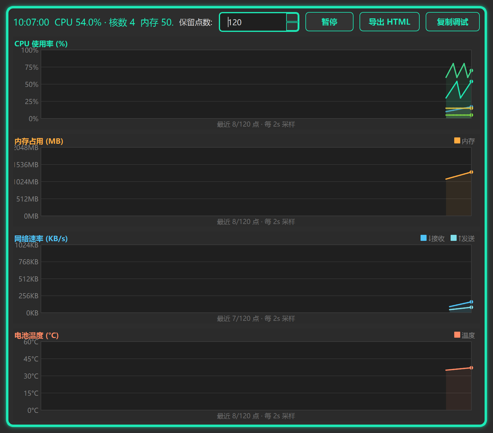
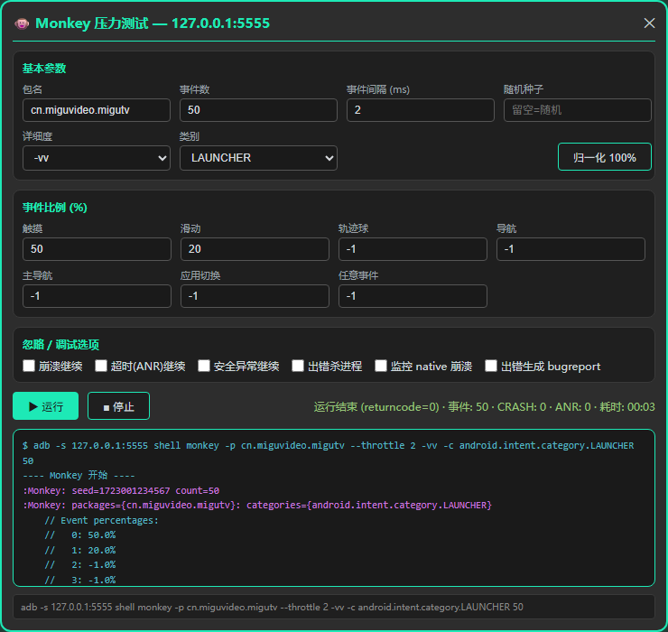
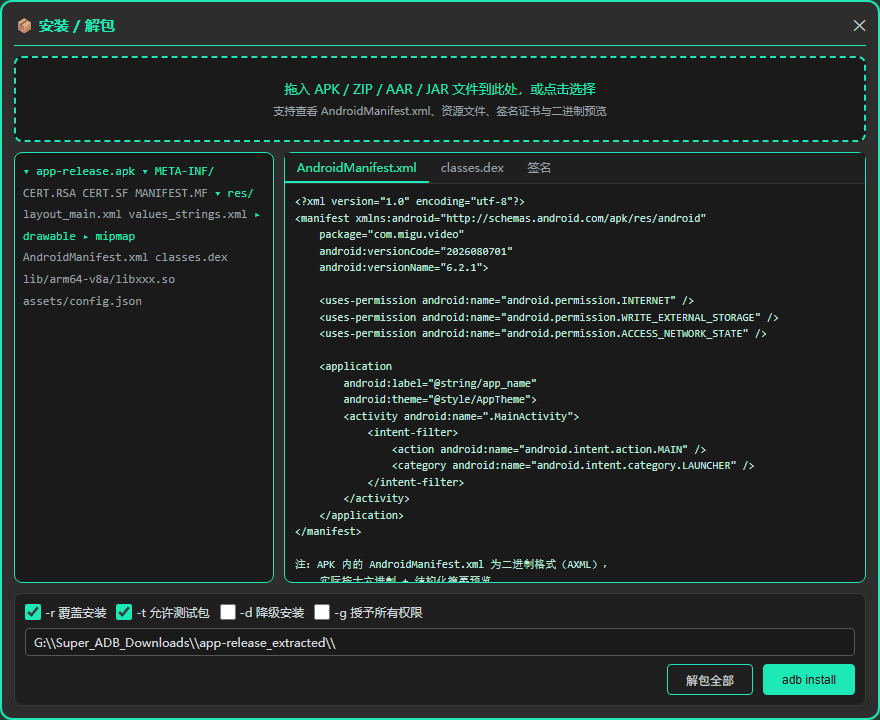
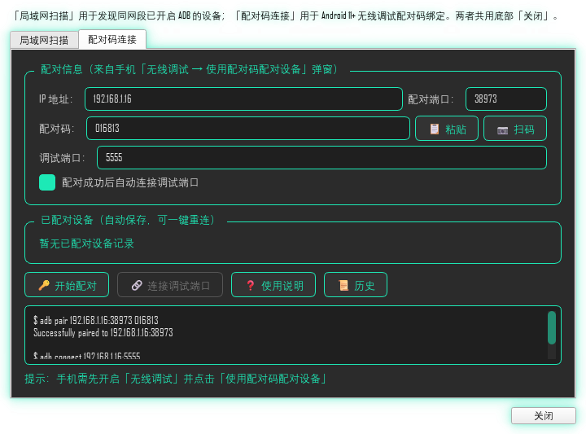
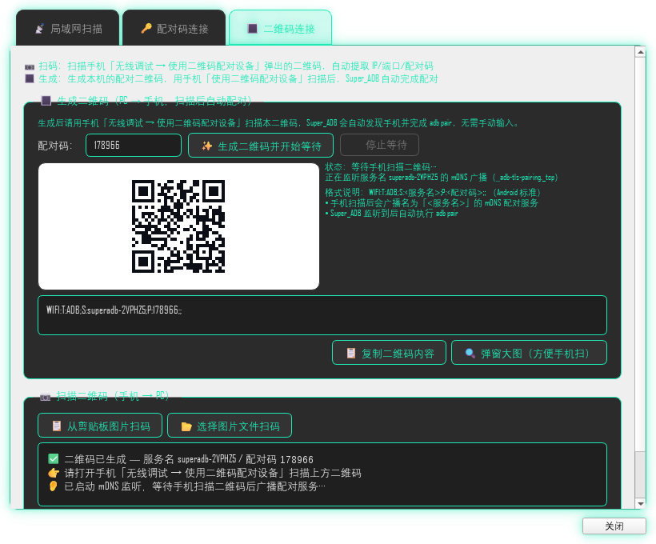
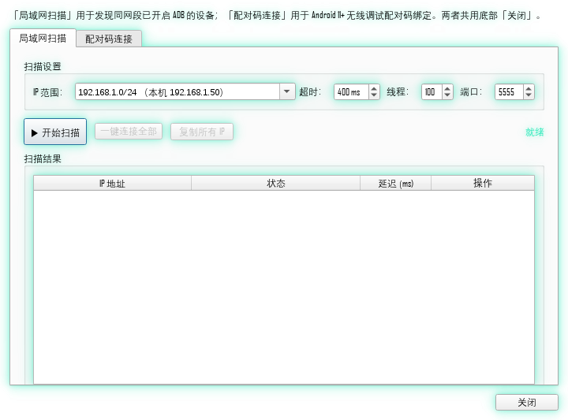
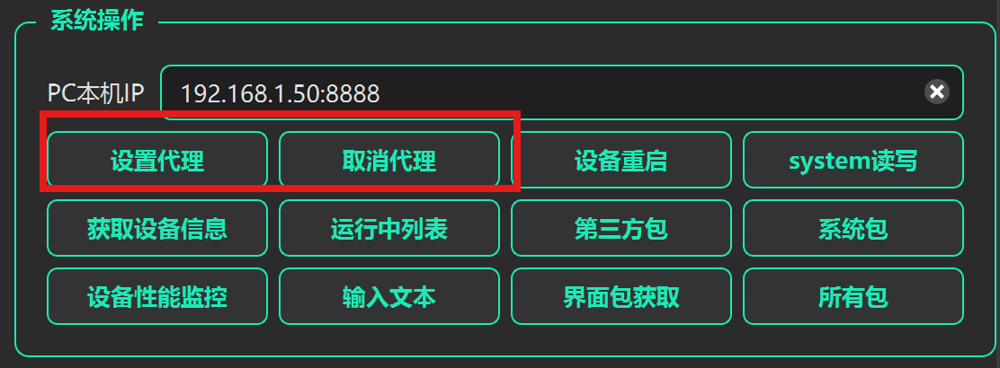

# Super_ADB —— ADB 集成调试工具

> 基于 **PySide6 + .ui 布局 + QSplitter 分屏** 的 Android 调试一体化工具箱，深色主题（可切换 6 套主题）。

## 简介

Super_ADB 把日常 Android 调试中最常用的操作——设备连接、系统操作、应用管理、文件传输、日志抓取、性能监控、Monkey 压测、scrcpy 投屏，以及一系列**纯本地**小工具（命令行 / JSON / MD5 / 时间戳转换 / WiFi 密码审计）——集成到一个界面里。免命令行也能完成大部分调试工作，同时保留了直接敲命令的入口。还有一只住在主窗口里、会躲避鼠标的小猫陪你加班。

## 功能特性

| 模块 | 能力 |
|---|---|
| **设备连接** | 刷新设备列表、连接 / 断开、一键重启（recovery / bootloader）、LAN 扫描自动发现 |
| **系统操作** | 设置 / 清除代理、system rw/ro 切换、设备信息、剪贴板写设备、PC 本机 IP 显示、**scrcpy 投屏**（分辨率/码率/帧率/编码/渲染驱动可调） |
| **应用操作** | 启动 / 停止 / 卸载 / 清除应用、运行应用列表、应用信息 |
| **文件管理** | 设备文件树浏览、上传 / 下载、权限操作（**右键「授权 777」**）、只读分区自动解锁引导 |
| **日志抓取** | 多标签 logcat、关键字过滤、标签 / 进程 / 消息星标、实时流式输出 |
| **性能监控** | 设备级（CPU / 内存 / 温度 / FPS）+ 应用级（12 项图表指标、内存泄漏检测、ANR / OOM 检测） |
| **Monkey 压测** | 命令模板、暂停 / 继续、实时事件饼图、崩溃报告拉取、事件回放 |
| **无线调试** | 三合一弹窗：局域网扫描（5555+CNNX 自动发现） / 配对码连接（adb pair） / 二维码连接（mDNS 自动监听 + 扫码回填） |
| **便捷工具** | 命令行、JSON 工具、MD5 校验、时间戳转换、WiFi 密码审计 |
| **桌面宠物** | 主窗口里的小猫，状态机驱动（idle/walk/run/play/sleep），自动躲避鼠标、气泡互动 |

### 便捷工具详解

- **命令行**：打开系统 PowerShell（Windows）/ 终端（macOS, Linux）。
- **JSON 工具**：格式化 / 压缩、差异对比、YAML 互转、Schema 校验、树形视图、**字典互转**（JSON ↔ Python dict 字面量）。
- **MD5**：MD5 / SHA1 / SHA256 / SHA512 / SHA3-256 / CRC32 / **PEM subject-hash** 多算法校验，拖入文件即算，进度条 + 复制全部 + CSV/JSON 导出；支持注册 Windows 右键菜单「计算哈希」。
- **时间戳转换**：Unix 时间戳 ↔ 北京时间实时双向互转，自动识别 秒 / 毫秒 / 微秒 / 纳秒。
- **WiFi 密码审计**：独立 CLI（`工具/WiFi密码破解.py`，multiprocessing + threading 双级并行），WPA PMKID 模式密码强度自测 + 本机已存 WiFi 密码恢复。

### 主题切换

标题栏下拉按钮可切换 6 套主题（`dark_teal` 默认 / `dark_cyan` / `dark_purple` / `dark_amber` / `dark_crimson` / `light_soft`），写入 `adb_shell_config.json`，下次启动自动加载。已打开的弹窗也会跟随主题刷新（2026-08-19 起统一处理）。

## 界面预览

<p align="center">
  
</p>

| 设备性能监控 | 应用性能监控 |
|:---:|:---:|
|  |  |

| Monkey 压测 | 安装 / 解包 |
|:---:|:---:|
|  |  |

| 无线调试（配对码连接） | 无线调试（二维码连接） |
|:---:|:---:|
|  |  |

| 无线调试（二维码弹窗大图） | 无线调试（局域网扫描） |
|:---:|:---:|
|  |  |

<p align="center">
  
</p>

## 功能增强总览（2026-08）

> 自「按清单顺序实现 + 完成后检查 + 推送」工作流启动以来，所有代码类需求均已实现并推送，无遗留未交付任务。

### 已实现功能

| # | 模块 | 关键能力 | 提交 |
|---|------|---------|------|
| 1 | Monkey 压测 | 模板 / 暂停恢复 / 事件饼图 / tombstone 拉取 / 回放 | `9dc7c0e` |
| 2 | 应用性能监控 | 内存泄漏自动 hprof 抓取 + 手动按钮；修复 ScrollChart 多系列 | `5289e0d` |
| 3 | .ui 布局同步 | PC IP + tcpdump 按钮移入 `ui/Super_ADB.ui` | `dd7bc62` |
| 4 | 设备性能监控 | 多核 CPU 分核 / 点数可配 + HTML 导出 / 网络速率 / 电池温度 | `fddf5c6` |
| 5 | 日志查看器 | 包名过滤修复 / 标签精确匹配 / 高亮增强 | `ddff4cb` + `a22d2bd` |
| 6 | 文件管理器 | 列表头列宽拖拽失效修复 | `6c2296b` |
| 7 | 命令输出 | 语法配色 + 关键字字重调细 | `4033232` + `27e654c` |
| 8 | 界面样式 | 控件字重 700→400 | `22199e9` |
| 9 | 关于对话框 | 开源地址改为 `super_-adb-2026` + 公众号引导 | `cbbfaf9` + `433c2cb` |
| 10 | 安装 / 解包 | APK 元信息解析崩溃修复 | `d3ce214` |
| 11 | tcpdump 抓包 | 「停止」按钮无响应修复 | `894cc13` |
| 12 | WiFi 密码查看器 | 本机已保存 WiFi / 密码（netsh 中英双关键字） | `972c582` |
| 13 | MD5 右键菜单 | 右键「计算哈希」图标修复 | `cfe58b6` |
| 14 | 设备连接 | 新增「WiFi 配对」弹窗（`adb pair` 配对码流程） | `1c7805f` |
| 15 | 统一无线调试入口 | 合并「局域网扫描」+「WiFi 配对」为单一面板；后续扩展为「局域网扫描/配对码连接/二维码连接」三标签页 | `e657c0a` |
| 16 | 二维码连接页 | 新增独立「二维码连接」标签页；扫码识别手机配对二维码并回填配对页；PC 端生成二维码供手机扫描后，Super_ADB 通过 mDNS 自动监听手机广播的 `_adb-tls-pairing._tcp` 服务并执行 `adb pair` 完成配对 | `061eecf` |
| 17 | scrcpy 投屏 + macOS 子项目 | 系统操作区增加「投屏 scrcpy」与「投屏设置」按钮；分辨率/码率/帧率/编码/渲染驱动可调并 `QSettings` 持久化；自动探测 `data/scrcpy/scrcpy-<platform>-vX.Y/` 按版本降序选最新；新增 `Super_ADB_MAC/` macOS 适配子项目 | `e5f1d2a` |
| 18 | 主题切换系统 | 标题栏下拉切换 6 套主题（dark_teal/dark_cyan/dark_purple/dark_amber/dark_crimson/light_soft），写入 `adb_shell_config.json`，重启恢复；移除最小化按钮（保留关于 / 主题 / 隐藏到托盘） | `ffdfa20` |
| 19 | 桌面宠物小猫 | `desk_cat.py` 派生子模块：状态机（idle/walk/run/play/sleep）+ 自动躲避鼠标 + 鼠标静止判断 + 撞墙放弃目标 + 跟随窗口几何 + qrc 资源图（不再依赖外部文件路径） | `dffe8bb` |
| 20 | 弹窗主题跟随 | 无线调试 / JSON 工具 / 局域网扫描 / tcpdump / Monkey / WiFi 历史 / MD5 / 时间戳 / 哈希右键 / 性能监控等弹窗跟随主窗口主题；新增 `apply_theme(theme_id)` 与 `_propagate_theme_to_dialogs`；独立进程（右键哈希）启动也读取持久化主题 | `e8e6734` |
| 21 | P0/P1 优化 | 中文输入主线程不再阻塞（`_TextSender` 后台）；录屏 PIPE 死锁修；统一 JSON IO 改走 `工具/JSON读写.py` 原子写 + warning 日志；收敛 subprocess 到 `AdbHelper`；`AdbDeviceOps.install()` 三阶段 push→pm→rm | `a4ba439` |
| 22 | 崩溃修复 + 只读引导 + 右键授权 | eventFilter 守卫（PySide6 6.11.1 偶发 TypeError 防崩）；`AdbDeviceOps.install` 进度条 + 三阶段；安装/MD5 弹窗全量主题化（含 `DropArea` 复用）；`push_stream` 自动检测只读分区附解锁引导；`root_and_remount` 真机自动跑 `disable-verity → reboot → wait-for-device → root → remount`；文件管理器右键「授权 777」+ `AdbFileManager.chmod` | `3ec5436` |

各模块详细文档见 [`feature_intro/`](feature_intro/)。

### 待办（文档侧）

- `super_-adb-2026` 功能介绍子仓内容同步（主仓 `关于对话框` 已指向该地址）
- 功能介绍文档模拟操作截图批量补齐
- scrcpy 投屏（#17）单独介绍文档待撰写
- 桌面宠物小猫（#19）作为趣味模块暂不单独出文档

## 目录结构

详见 [`项目结构图.md`](项目结构图.md)；模块依赖关系见 [`依赖关系图.md`](依赖关系图.md)。

## 安装

```bash
# 需要 Python 3.13+（推荐 3.14），并确认 adb 已配置且在 PATH 中
pip install -r requirements.txt
```

项目运行仅依赖 **PySide6** 与 **Pillow** 两项第三方包，其余均为 Python 标准库。**Optional 依赖**：`segno`（生成无线调试配对二维码）、`zeroconf`（mDNS 监听，实现手机扫码配对）、`ifaddr`（本机 IP 探测），缺这些功能会失效但程序不崩，可按需安装。

另：`pyzbar`（二维码扫码解码，替代原 OpenCV）由 `打包/精简打包exe.py` 的 `hidden-import` + `打包/hooks/hook-pyzbar.py` 在打包时引入，`requirements.txt` 未显式声明，运行环境需另行安装（打包产物已自带 `libzbar-64.dll`）。

## 运行

```bash
python Super_ADB_Main/Super_ADB_Main.py
```

可选首次启动附加参数：

- `--hash <文件路径>`：独立进程运行右键哈希计算（被 Windows 资源管理器右键菜单调用），不打开主窗口。
- `--hidden`：启动时直接隐藏到托盘（用于开机自启场景）。

## 开发说明

### 主窗口透明背景 + 4px 主题色边框（无 glow 特效）

主窗口是**无边框 + 透明背景**的 `QMainWindow`：

- `__init__` 设 `setAttribute(WA_TranslucentBackground, True)`；
- `paintEvent` 先 `fillRect` 涂一层 **alpha=1** 的主题色底衬（肉眼不可见，约 0.4% 不透明度），再 `super().paintEvent(ev)` 画子控件，最后用 `QPainter` 画一圈 **4px 主题色实色圆角边框**。

> 注意：**主窗口自身不使用 `QGraphicsDropShadowEffect`**。多层柔光外框（DropShadow halo）只存在于**弹窗卡片**（见下方「弹窗卡片的主题色发光」）。

```python
# ① __init__：透明背景（否则 rgba alpha 被当成不透明实色）
self.setAttribute(Qt.WidgetAttribute.WA_TranslucentBackground, True)

# ② paintEvent：alpha=1 透明底衬（保 hit-test）+ 4px 主题色实色边框
def paintEvent(self, ev):
    painter = QPainter(self)
    t = THEMES.get(self._current_theme, THEMES[DEFAULT_THEME])
    underlay = QColor(t['bg_window']); underlay.setAlpha(1)  # 关键：1/255 alpha
    painter.fillRect(self.rect(), underlay)
    super().paintEvent(ev)                                  # 子控件覆盖底衬
    r, g, b = self._parse_accent_rgb()
    painter.setPen(QPen(QColor(r, g, b, 200), 4))           # 4px 主题色边框
    painter.drawRoundedRect(self.rect().adjusted(2, 2, -2, -2), 8, 8)
```

**弹窗卡片的主题色发光**由 `popup_style` 统一提供（不是主窗口）：

- 弹窗 `__init__` 调 `add_green_glow(self.card, accent=QColor(r, g, b))` 挂一个 `QGraphicsDropShadowEffect`（默认 `alpha=200`，颜色跟随主题 `accent`）；
- 主程序 `_propagate_theme_to_dialogs` 在切主题时遍历已打开弹窗，调用各弹窗 `apply_theme(theme_id)` 并 `rebuild_glow`（重建 effect 实例 + 微抖动 blurRadius，绕过 PySide6 6.11.1 + DWM 的 halo bitmap 缓存坑）。

#### 关键坑（PySide6 6.11.1 + Windows 实测）

| 坑 | 现象 | 结论 |
|---|---|---|
| `QGraphicsDropShadowEffect.setColor()` 不 invalidate 缓存 | 切主题后弹窗 halo 停留旧色 | 必须**重建 effect 实例**（`rebuild_glow` 每次新建 effect）+ blurRadius 微差（22~25 抖动）强制 DWM 失效；`update()` / detach-reattach 不够（reattach 还会抛 *already deleted*） |
| Windows 分层窗口**逐像素 alpha 命中测试** | 子 widget 写 `background: transparent` 区域点击穿到下层，拖不动窗口；`WM_NCHITTEST` 在 nativeEvent 之前就被系统过滤 | `paintEvent` 里 `fillRect` 整窗 **alpha=1** 底衬（肉眼不可见）保证无 alpha=0 像素 |
| Qt6 + `WA_TranslucentBackground` 下 top-level 窗口**不绘制 stylesheet 背景** | 即便 QSS 写 `QMainWindow{background-color:...}`，主窗表面仍是 alpha=0 | alpha=1 底衬同时承担"主窗底色兜底"职责（`_main_stylesheet` 不再写主窗背景色） |
| `paintEvent` 里 `fillRect` 用 **alpha=255** | 子控件会被不透明底盖住、整窗不再透明 | 底衬只能用 alpha=1（透明且 hit-test 正常） |
| `nativeEvent` 解析 MSG 报 `ImportError` | `PySide6.QtCore` 不稳定导出 `MSG` | 用 `ctypes` 自定义 `_MSG` 结构（6 字段，sizeof=48）+ `_MSG.from_address(int(message))` 解析 |

#### QSS 通用规则

透明无边框窗口里，**任何需要接收点击的 QWidget 都不要写完全透明背景**：

```css
/* ❌ alpha=0 → Windows 判定 click-through，点不动 */
QWidget { background: transparent; }

/* ✅ alpha=1/255 → 肉眼不可见，命中测试正常 */
QWidget { background: rgba(0, 0, 0, 1); }
```

#### 三层 hit-test 保险（缺一不可，按优先级）

1. **alpha=1 底衬**（`paintEvent` `fillRect`）——主保险，保证整窗无 alpha=0 像素；
2. **`nativeEvent` 拦 `WM_NCHITTEST` 返 `HTCLIENT`**（ctypes `_MSG` 解析）——双保险；
3. **弹窗 glow 重建**（`rebuild_glow` 每次新建 effect）——保证主题色 halo 实时跟随（仅针对弹窗卡片，主窗口用 paintEvent 边框）。


- **UI 与逻辑分离**：界面布局由 `ui/Super_ADB.ui`（Qt Designer）定义，通过 `pyside6-uic` 生成 `Super_ADB_Main/Super_ADB.py`。
  ```bash
  pyside6-uic ui/Super_ADB.ui -o Super_ADB_Main/Super_ADB.py
  ```
  ⚠️ **不要手改 `Super_ADB.py`**——它是自动生成的，下次重新生成会被整体覆盖。
- **新增主页控件**：改 `ui/Super_ADB.ui` → 重新 uic 生成 `Super_ADB.py` → 在主窗口用 `self.xxxBtn` 接信号即可。
- **模块划分**：按功能划分子目录 `对话框/`（弹窗）、`页面/`（主窗口子页面）、`监控/`（性能监控）、`工具/`（工具模块）、`脚本/`（构建/测试脚本）、`打包/`（PyInstaller 打包专用：含 `hooks/` 钩子与 `.spec` 配置，不进运行时 sys.path）。`Super_ADB_Main.py` 启动时把 `对话框/ 页面/ 监控/ 工具/` 加入 `sys.path`，因此模块间仍可用裸模块名互相 import，无需改任何 import 语句。
- **延迟 import**：重型子模块（所有弹窗 + 性能监控）在 `Super_ADB_Main.py` 改为对应的 `open_xxx` 方法内局部 import，避免启动即加载 `应用性能监控`（3407 行）等巨型模块。
- **主题切换**：所有弹窗/窗口都应支持 `apply_theme(theme_id)` 回调；新建弹窗需手动在创建时使用 `get_stylesheet(self._current_theme)` 而非硬编码 `STYLE_SHEET`。
- **资源管理**：图标等资源由 `ui/png.qrc` 经 `pyside6-rcc` 编译为 `Super_ADB_Main/png_rc.py`，同样勿手改。

## 环境要求

- Python ≥ 3.13
- 已安装并配置 ADB（在 PATH 中）
- Windows / macOS / Linux（核心功能跨平台；Windows 右键「计算哈希」集成仅限 Windows）

## 跨平台 / macOS 兼容性

- 主项目本身核心代码已大半跨平台，已埋 `darwin/linux/win32` 平台分支。
- 「系统操作 scrcpy 投屏」「WiFi 密码查看」「Windows 右键哈希」「剪贴板写设备」「只读分区 disable-verity 流程」这些为非跨平台功能（详见 [`macOS_compatibility_plan.md`](macOS_compatibility_plan.md)）。
- macOS 适配工作副本：`Super_ADB_MAC/Super_ADB/`（独立项目，2026-08-13 已推 `super_adb.git/master`，提交 `e5f1d2a` 起纳入）。

## 许可证

详见仓库 `LICENSE`。

## 关注公众号

微信公众号：**Super_ADB**（微信搜索 `Super_ADB`）


使用过程中遇到 Bug、有改进建议，或想看详细使用教程，欢迎扫码关注公众号留言反馈。

## 下载地址

> 夸克网盘分享链接会定期更新，请以最新版为准。

我用夸克网盘给你分享了「Super_ADB」：

- 链接：<https://pan.quark.cn/s/9f4e9c4b916b>
- 口令：`/~a97c3a4KdV~/`

点击链接或复制整段内容，打开「夸克 APP」即可获取。
