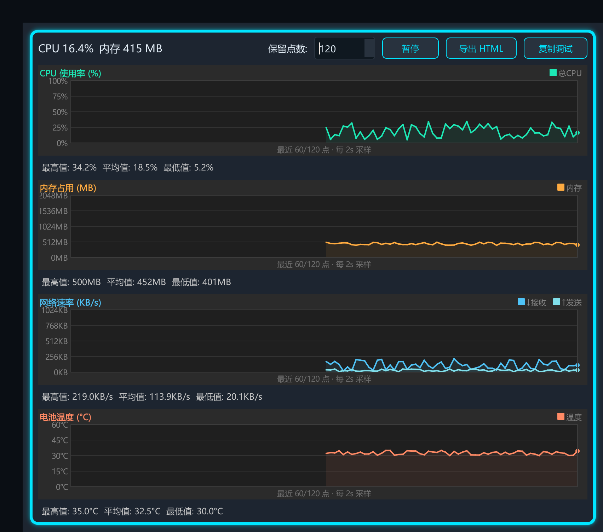
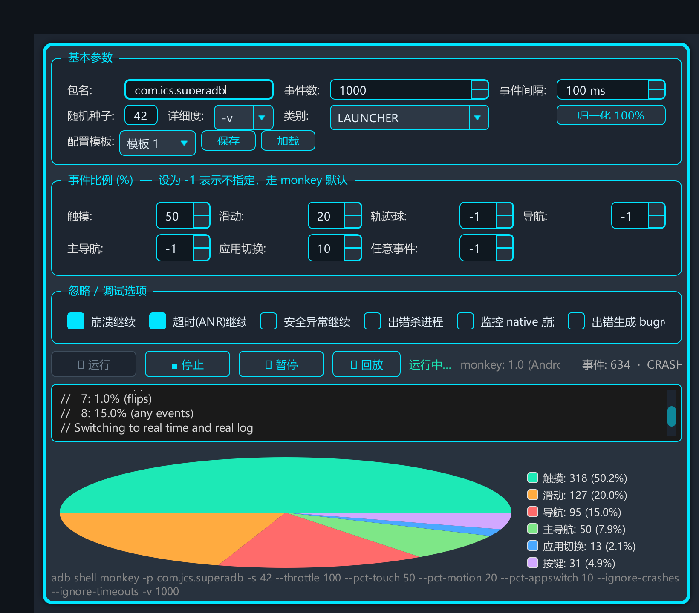
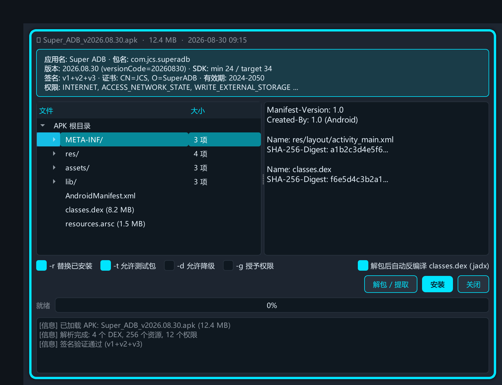
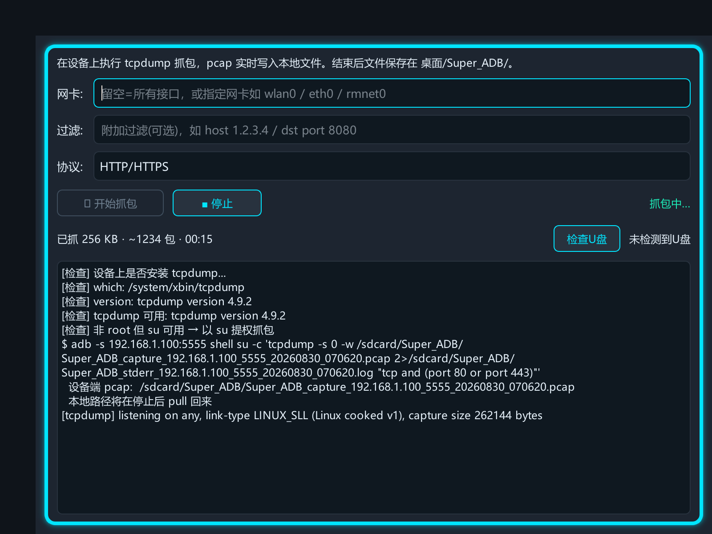
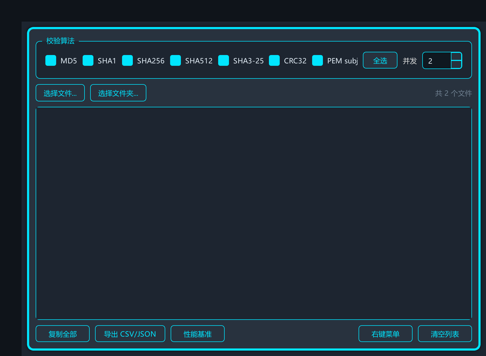

# 功能介绍与使用说明

> Super_ADB 核心功能模块的详细介绍、操作步骤与界面展示。

## 🖥️ 主界面

**功能介绍**

主界面采用左侧设备列表 + 右侧 Tab 页面的布局，顶部为系统操作区，底部为状态栏。集成设备连接、系统操作、应用管理、文件传输、日志抓取、性能监控六大核心功能于一体。

**使用说明**

1. 启动后自动扫描已连接的 USB 设备和局域网设备
2. 左侧列表选择目标设备，右侧 Tab 切换功能页面
3. 顶部按钮区提供一键重启、代理设置、投屏、抓包等快捷操作
4. 标题栏下拉菜单可切换 6 套主题，设置自动保存

---

## 🔌 设备连接与无线调试

**功能介绍**

三合一无线调试弹窗，支持局域网扫描自动发现、配对码连接（adb pair）、二维码连接（mDNS 自动监听 + 扫码回填）三种方式。同时支持 USB 直连，自研 ADB 协议栈与官方 adb 可一键切换。

**使用说明**

1. **USB 连接**：手机开启 USB 调试，插入数据线，设备列表自动出现
2. **局域网扫描**：点击「无线调试」→「局域网扫描」，自动扫描 5555 端口设备
3. **配对码连接**：手机开发者选项 → 无线调试 → 使用配对码配对，输入 6 位配对码
4. **二维码连接**：手机展示配对二维码，PC 端扫码自动完成 mDNS 发现与配对

---

## 📁 文件管理

**功能介绍**

设备文件树浏览器，支持上传/下载、删除、重命名、权限修改（右键「授权 777」）、文本预览、递归搜索。自研 ADB sync 协议快速传输，上传速度可达官方 adb 的 2.7 倍。只读分区自动检测并附解锁引导。

**使用说明**

1. 选择设备后自动加载根目录文件列表
2. 双击文件夹进入，点击路径栏可快速跳转
3. 拖拽本地文件到窗口即可上传，右键文件可下载/删除/重命名
4. 搜索框支持当前路径和递归搜索两种模式
5. 右键「授权 777」可快速修改文件权限（需 root）

---

## 📋 日志抓取

**功能介绍**

多标签 logcat 查看器，支持关键字过滤、标签/进程/消息星标、实时流式输出、日志级别筛选、导出保存。可同时打开多个设备的日志标签页，互不干扰。

**使用说明**

1. 选择设备后自动启动 logcat 实时输出
2. 顶部过滤框输入关键字实时过滤，支持正则表达式
3. 点击日志行左侧星标可标记重要日志，过滤栏可只看星标
4. 右键可复制单行/全部日志，或导出为 .txt 文件
5. 「新建标签」可同时监控多个设备或多个过滤条件

---

## 📊 性能监控

**功能介绍**

双层性能监控体系：设备级（CPU 多核分核/内存/温度/FPS/网络速率）+ 应用级（12 项图表指标、内存泄漏自动检测、ANR/OOM 检测、hprof 自动抓取）。支持 HTML 报告导出，数据实时刷新。

**使用说明**

1. **设备级监控**：主界面「性能监控」Tab，实时显示 CPU/内存/温度/FPS 曲线
2. **应用级监控**：选择目标应用，点击「应用性能监控」打开独立窗口
3. 内存泄漏检测自动运行，发现泄漏时自动抓取 hprof 并提示
4. 监控结束后可导出 HTML 报告，包含所有图表和异常记录
5. 图表支持缩放、暂停、数据点查看

---

## 🐒 Monkey 压测

**功能介绍**

Monkey 压力测试管理窗口，支持命令模板自定义、暂停/继续/停止控制、实时事件饼图统计、崩溃报告自动拉取、事件回放。可设置事件数、间隔、种子、触摸/手势/轨迹球比例等参数。

**使用说明**

1. 选择目标应用，设置事件总数、间隔时间、种子等参数
2. 点击「开始」启动 Monkey，实时显示事件统计饼图
3. 运行中可随时「暂停」/「继续」/「停止」
4. 发生崩溃时自动拉取 tombstone 和 logcat 崩溃报告
5. 支持事件回放，用相同种子复现崩溃场景

---

## 📦 应用管理（安装/解包）

**功能介绍**

APK 安装与解包工具，支持拖拽安装、批量安装、安装进度实时显示、APK 元信息解析（包名/版本/权限/组件）、解包查看资源。三阶段安装流程（push → pm install → rm），失败时自动诊断原因。

**使用说明**

1. 拖拽 APK 文件到窗口，或点击「选择 APK」浏览
2. 自动解析 APK 信息（包名、版本、权限列表、四大组件）
3. 点击「安装」开始，进度条实时显示上传和安装进度
4. 安装失败时显示具体原因（空间不足/签名冲突/版本降级等）
5. 「解包」可查看 APK 内部资源文件结构

---

## 🌐 网络抓包

**功能介绍**

tcpdump 网络抓包 + PCAP 解析一体化工具。自动检测设备架构并推送对应 tcpdump 二进制（arm64/arm），支持 BPF 过滤器、实时包数统计、停止后自动拉取 pcap 文件并解析。PCAP 解析器支持 HTTP/HTTPS/TCP/UDP 协议分析、流重组、请求/响应查看。

**使用说明**

1. 点击「网络抓包」打开窗口，自动检测设备是否已安装 tcpdump
2. 未安装时自动推送对应架构的二进制到 /data/local/tmp/（需 root）
3. 输入 BPF 过滤器（如 "tcp and port 80"），点击「开始抓包」
4. 实时显示捕获包数、过滤器接收数、内核丢包率
5. 点击「停止」自动拉取 pcap 文件并进入解析界面
6. 解析界面可查看每个数据包的详细信息，支持 HTTP 请求/响应查看

---

## 📺 scrcpy 投屏

**功能介绍**

集成官方 scrcpy 投屏工具，支持分辨率/码率/帧率/编码器/渲染驱动等参数自定义。低延迟投屏，支持键鼠反向控制、文件拖拽传输、屏幕录制。参数设置自动保存，下次启动自动加载。

**使用说明**

1. 选择设备后点击「投屏」按钮启动 scrcpy
2. 「投屏设置」可调整分辨率（默认 1080p）、码率（默认 8Mbps）、帧率（默认 60fps）
3. 可选择编码器（h264/h265）和渲染驱动（direct3d/opengl/metal）
4. 投屏窗口中可直接用键鼠控制手机，拖拽文件到窗口即可传输
5. 支持屏幕录制，录制文件保存到本地

---

## 🛠️ 便捷工具

**功能介绍**

集成多款实用小工具：命令行（PowerShell/终端）、JSON 工具（格式化/压缩/差异对比/YAML 互转/Schema 校验/树形视图）、哈希校验（MD5/SHA1/SHA256/SHA512/CRC32 等 8 种算法，支持 Windows 右键菜单）、时间戳转换（秒/毫秒/微秒/纳秒自动识别）、ADB 交互式终端、设备信息查看。

**使用说明**

1. **命令行**：一键打开系统终端，自动切换到项目目录
2. **JSON 工具**：粘贴 JSON 自动格式化，支持左右对比差异，树形视图展开
3. **哈希校验**：拖拽文件即算，支持多算法同时计算，可注册 Windows 右键菜单
4. **时间戳转换**：输入时间戳自动识别单位并转换为北京时间，双向互转
5. **ADB 终端**：交互式 adb shell，支持命令历史和自动补全
6. **设备信息**：一键查看设备型号、Android 版本、序列号、屏幕分辨率、IP 地址等

---

## 📢 关注公众号

扫码关注公众号，获取最新版本更新、使用教程和技术分享：

---

## ⬇️ 下载地址

最新版本下载：

- **夸克网盘**：https://pan.quark.cn/s/2b7b11ebe1e5?pwd=fAXN

> 提取码：fAXN
